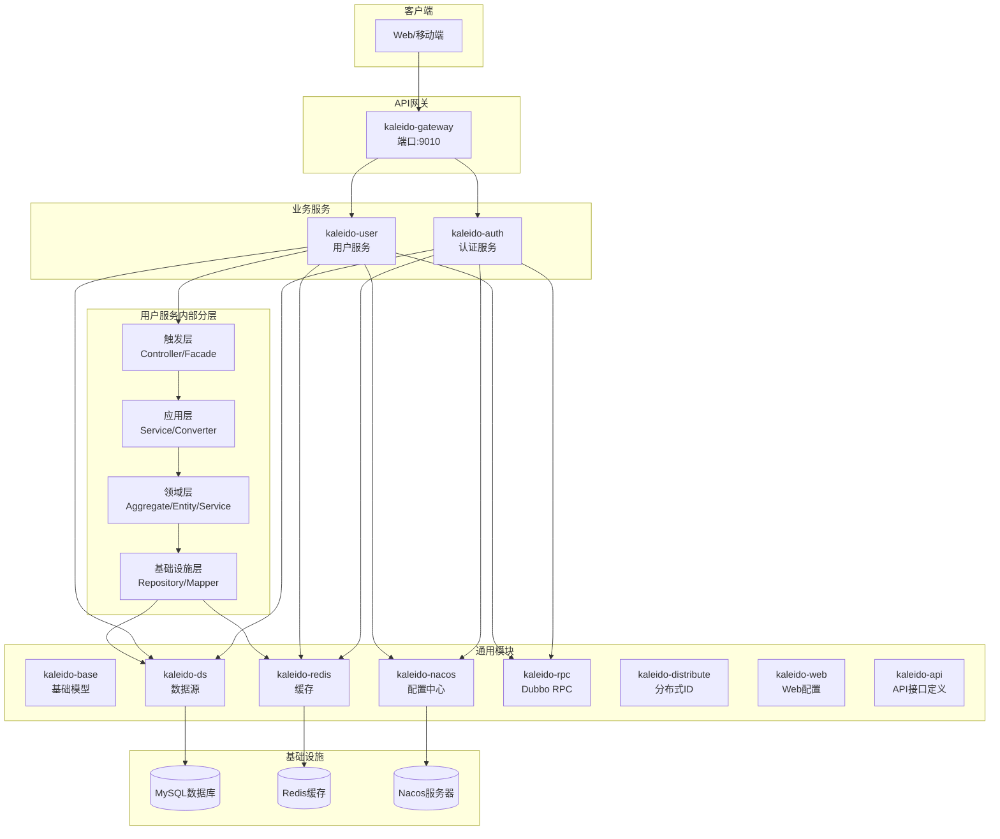

# Kaleido 微服务架构图

## 分层说明

1. **客户端**：通过API网关访问服务。
2. **API网关**：基于Spring Cloud Gateway，负责路由、负载均衡和跨域。
3. **业务服务**：独立的微服务（auth, user等），每个服务包含完整的分层。
4. **通用模块**：可复用的组件，通过依赖注入提供能力。
5. **基础设施**：外部依赖（数据库、缓存、配置中心）。

## 数据流

- 外部请求 → 网关 → 业务服务 → 领域层 → 基础设施层 → 数据库/缓存。
- 服务间通信通过Dubbo RPC（基于Nacos服务发现）。
- 配置和发现通过Nacos集中管理。
- 缓存使用Redis + JetCache（本地缓存Caffeine +远程缓存Redisson）。
- 分布式ID使用雪花算法（基于Hutool + 自定义WorkerId）。